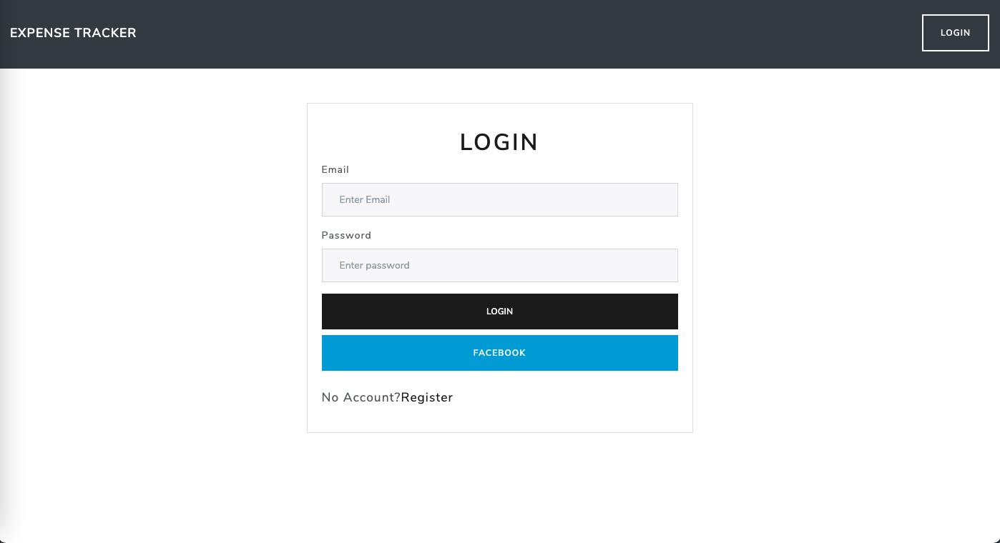
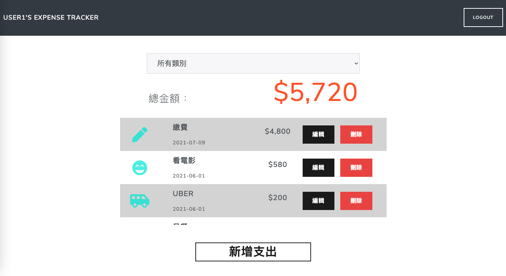

# [Expense Tracker](https://damp-island-27606.herokuapp.com/users/login)

Expense Tracker website built with Node.js and Express
  You can record you expense on this website


## Test account

>* name: user1
>* email: user1@example.com
>* password: 123456

>* name: user2
>* email: user2@example.com
>* password: 123456
# Features
* Show name, date, category icon, amount of all expenses
* Show expenses by filter category  
* Create a new expense
* Edit expense
* Delete expense
* Register account
* Login by your account or Facebook
* Show your own records when you login





# Getting Started
Clone respository to your local computer
```
$ git clone https://github.com/naluwan/expense-tracker.git
```
Install by npm
```
$ npm install
```
Seeds
```
$ npm run seed
```
Execute
```
$ npm run dev
```
Terminal show the message
```
Express is running on localhost:3000
```
Now you can browse the website on
```
http://localhost:3000
```
# Built With
* Node.js: 10.24.1
* Express: 4.17.1
* Express-Handlebars: 5.3.2
* Handlebars-Helpers: 0.10.0
* Body-Parser: 1.19.0
* Mongoose: 5.12.13
* Method-Override: 3.0.0
* passport: 0.4.1
* connect-flash": 0.1.1
 
# Author
NaLuWan 簡碩亨
